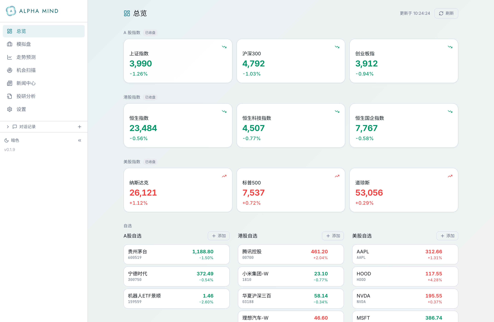
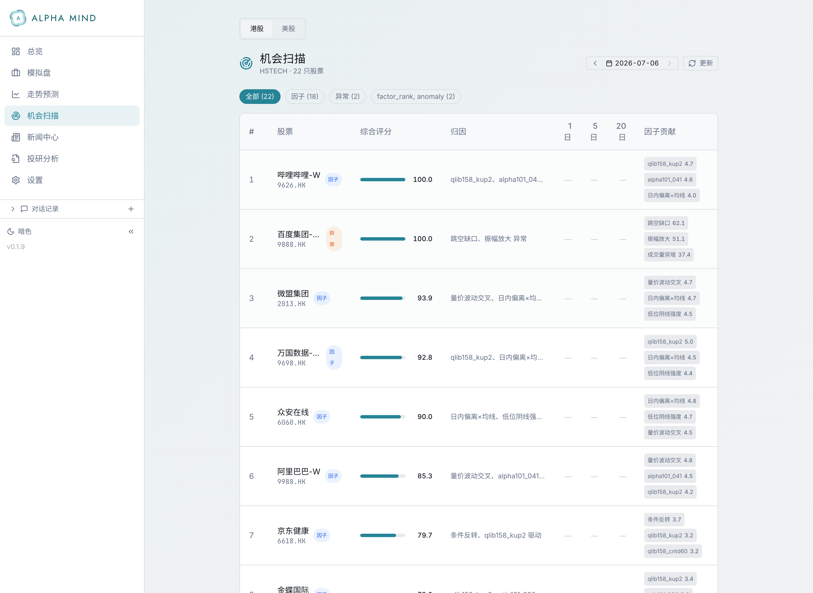
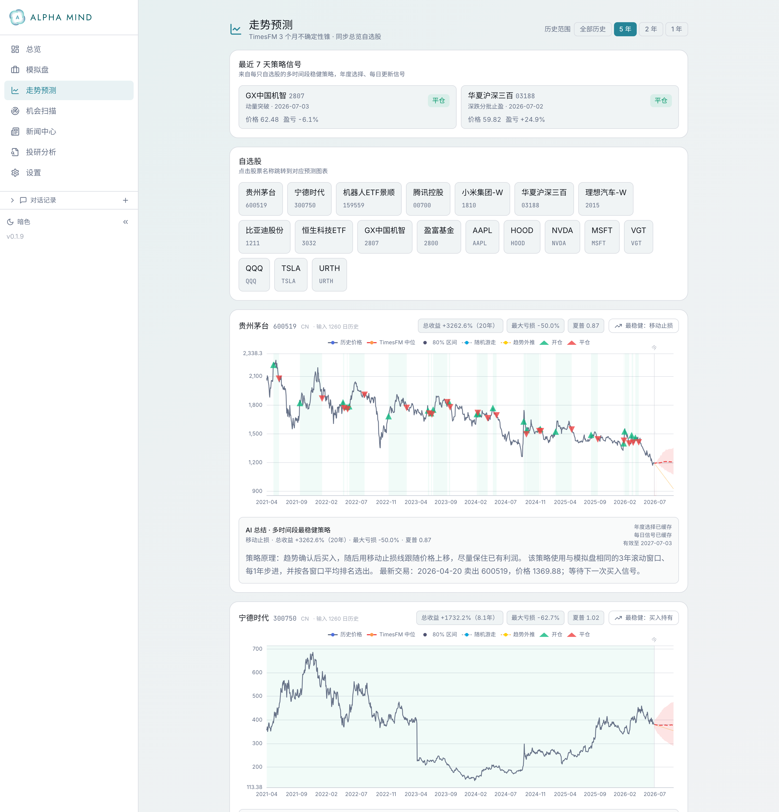
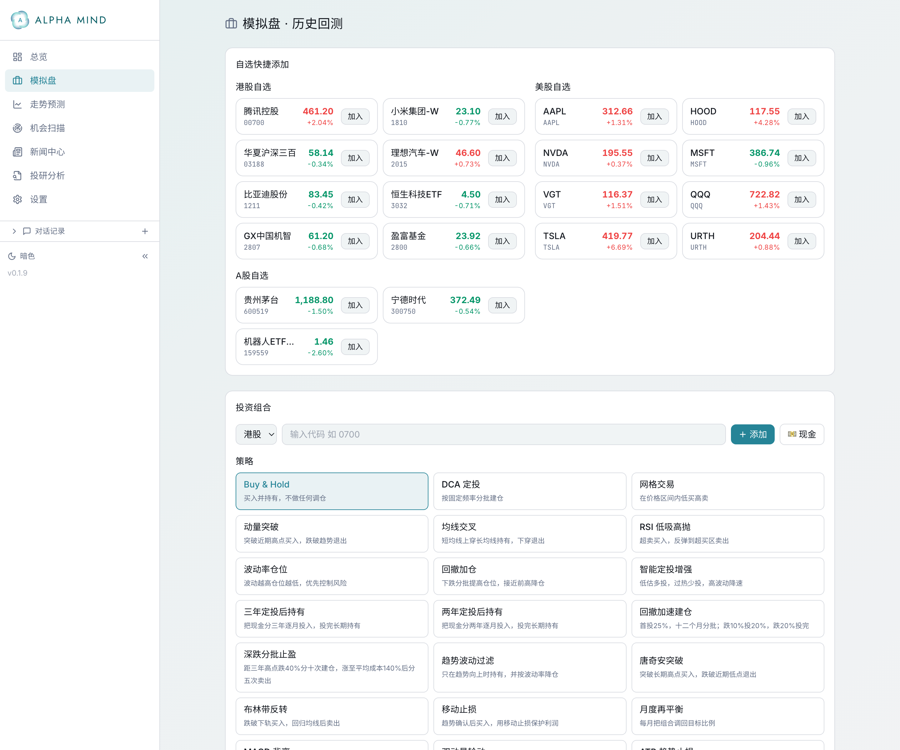

<div align="center">


# Alpha Mind · 量化之心

**AI 驱动的个人量化研究与交易助手**

多市场行情 · 机会扫描 · 走势预测 · 策略回测 · 智能体投研 —— 集成在一个清爽的本地应用里。


</div>

---

## ✨ 一眼概览

A股 / 港股 / 美股 大盘指数与自选股一屏尽览,收盘 / 交易中状态实时标记,细体中文 + 雾玉配色的清爽界面。



---

## 🎯 核心功能

### 📡 机会扫描 · 会自我验证的选股

因子 / 异常 / 事件三路信号融合打分与排名,逐只展示**归因**与**因子贡献**。每个交易日定时扫描,并自动回填推荐后 **1 / 5 / 20 日的真实前瞻收益** —— 让排名自己证明有没有效。



### 📈 走势预测 · TimesFM 不确定性锥

基于 TimesFM 时序基础模型给出未来约 3 个月的**预测中位与 80% 置信区间**,叠加多时间段稳健策略的历史开 / 平仓信号,并附上 AI 生成的"最稳健策略"总结。



### 🧪 模拟盘 · 历史回测

支持买入持有、定投、网格、动量突破、移动止损、风险平价等 **30 多种策略**和稳健性优化，可配置多市场投资组合、回测区间与初始资金，并展示净值、回撤、分标的统计和交易明细。



### 📰 更多

- **新闻中心** — 自选股、指数与重点行业的每日投资简报,利好 / 利空标注
- **投研分析** — 自然语言驱动的智能体研究(ReAct 推理 + 工具调用)
- **多因子库** — Qlib158 / Alpha101 / GTJA191 / 学术因子等开箱即用
- **响应式 + 局域网访问** — 电脑与手机同一套界面,支持深浅色

---

## 🏗 技术栈与结构

**后端** FastAPI · Python 3.11+ · yfinance / akshare / ccxt 行情 · TimesFM 预测
**前端** React 19 · TypeScript · Vite · Tailwind · ECharts

```
agent/                Python 后端
  api_server.py         FastAPI 服务(REST API,端口 8899)
  mcp_server.py         MCP 服务
  cli/                  命令行入口(serve / run ...)
  src/                  功能模块(scanner 机会扫描、forecast 走势预测、
                        paper_trading 模拟盘、news_center 新闻中心、
                        factors 因子库、market_data 行情 ...)
  backtest/             回测引擎与数据加载器
  tests/                pytest 测试
frontend/             React + Vite 前端(端口 5899)
scripts/              运维脚本(daily_scan.py 每日定时扫描等)
```

---

## 🚀 本地运行

需要 Python ≥ 3.11、Node.js,以及仓库根目录的 `.venv`。

**后端**(REST API,端口 8899):

```bash
.venv/bin/python -c 'import cli, sys; raise SystemExit(cli.main(sys.argv[1:]))' \
  serve --host 127.0.0.1 --port 8899
```

**前端**(Vite,端口 5899,已开启局域网访问):

```bash
cd frontend
npm install      # 首次
npm run dev
```

浏览器打开 http://localhost:5899 ;同一 Wi-Fi 下手机访问 `http://<本机IP>:5899`。

---

## 🧪 测试

```bash
cd agent && ../.venv/bin/pytest        # 后端
cd frontend && npm run test:run        # 前端
```

---

## 📄 致谢与许可

Alpha Mind 在开源项目 [HKUDS/Vibe-Trading](https://github.com/HKUDS/Vibe-Trading) 的基础上二次开发并大幅定制。遵循 MIT 许可,原作者与第三方(Microsoft Qlib、Alpha101、GTJA191 等)署名见 [LICENSE](LICENSE) 与 [NOTICE](NOTICE)。

> 本项目仅用于个人量化研究与学习,不构成任何投资建议。
